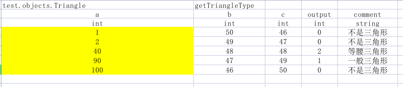
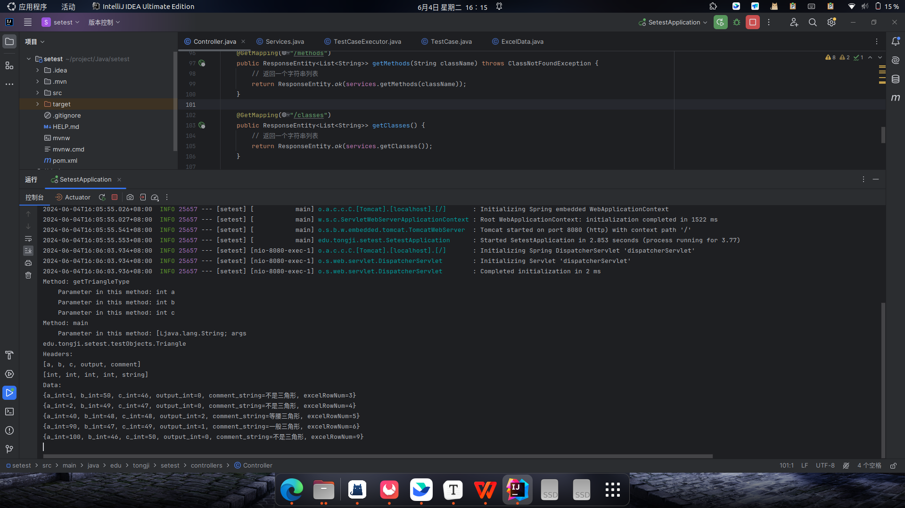

### 测试用例:

存储在`src\main\java\test\cases`文件夹下, 为`.xlsx`等Excel文件:

- 第一行: 标题行, 对应代码中的`titleRow`, 一般记录待测试代码的类路径和方法
- 第二至三行: 表头, 对应代码中的`headers`, 
  第二行记录输入变量名称, output(不可改动), comment(注释), 但程序不对这一行做检查.
  第三行记录输入变量类型, 输出变量类型, string, 程序会对待测试代码中方法的传参类型进行检查.
- 后续行: 输入数据和输出数据`data`

以下需要注意的地方:

1. 标题行的类路径需要小心, 以`.`号隔开, 保证待测试代码的位置与类路径一致.
2. 标题行的类路径和方法名称务必写在第一个位置和第二个位置, 最好不要单元格合并.

### 程序运行:

运行`Application.java`文件, 命令行传入测试脚本的路径, 运行例子如下:

传参: `src/main/java/test/cases/ex1.xlsx`

