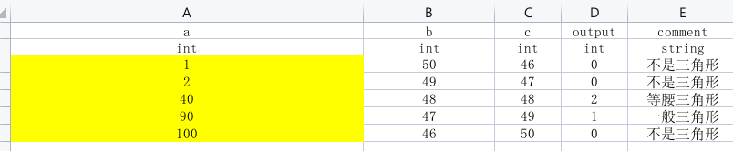

### API:

jsxA001 在 Apifox 中邀请你加入团队 软测作业 https://app.apifox.com/invite?token=V3zKwSI4_QMZHJH7KnZB3

#### 获取所有待测试类(不依赖其他api)

#### 获取某个类中的所有方法(不依赖其他api)

#### 确定待测试类名称

#### 上传测试用例

#### 执行类中需要测试的方法

### 测试用例:

存储在`src\main\java\test\cases`文件夹下, 为`.xlsx`等Excel文件:

- 第一至二行: 表头, 对应代码中的`headers`, 
  第一行记录输入变量名称, output(不可改动), comment(注释), 但程序不对这一行做检查.
  第二行记录输入变量类型, 输出变量类型, string, 程序会对待测试代码中方法的传参类型进行检查.
- 后续行: 输入数据和输出数据`data`

### 程序运行:

运行`Application.java`文件:

### ToDo List

- [x] Ex1
- [x] Ex2
- [x] Ex3
- [ ] Ex4
- [ ] Ex5
- [ ] Ex6
- [ ] Ex7
- [ ] Ex8
- [ ] Ex9
- [ ] Ex10
- [ ] Ex11
- [ ] Ex12
- [ ] Ex13
- [ ] Ex14
- [ ] Ex15
- [ ] Ex16
